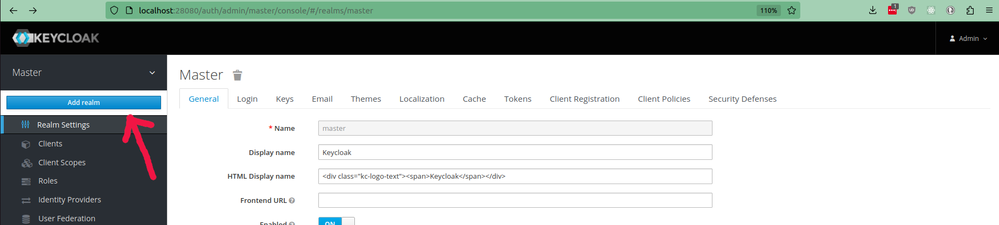

.. _developers_oidc:

============
Testing OIDC
============

To test logging in with OIDC, we can use Keycloak. Keycloak can be run locally with a Docker container.

You can use the following ``docker-compose.yml`` file to run the Keycloak container (plus a postgres database).

.. literalinclude:: assets/docker-compose-keycloak.yaml
   :language: yaml

Once the containers are up and running, execute the following command:

.. code-block:: bash

    docker exec local_keycloak \
      /opt/jboss/keycloak/bin/add-user-keycloak.sh \
      -u admin \
      -p admin \
      && docker restart local_keycloak

This will create an admin user with credentials ``admin`` / ``admin`` with which you can login into the Keycloak admin.

Now you can navigate to ``http://localhost:28080/auth/`` in the browser. Then, click on **Administration Console** and
log in.

Keycloak configuration
======================

* Create a new realm. This can be done by hovering over **Master** in the top-left corner.

  * Fill in the **Name**: ``open-zaaktypebeheer``.
  * Click on **Create**.

* Navigate to **Client** (menu on the left) and then click on **Create** (button on the top right op the table).
  Then fill in:

  * **Client ID**: ``open-zaaktypebeheer``.
  * **Root URL**: ``http://127.0.0.1:8000`` (the URL of the backend for the frontend).

  Click on **Save**. More configuration options appear. Fill in:

  * **Valid Redirect URIs**: Add a new field with the URL of where the frontend is served. For example ``http://127.0.0.1:5173/*``.

  Click on **Save** again.

* Navigate to **Users** (menu on the left) and then click on **Add user** (button in the top right).
  Fill in:

  * **Username**: ``test``
  * **email**: ``aaa@aaa.aaa``
  * **First name**: ``Test``
  * **Last name**: ``Test``

  Click on **Save**.  More configuration options appear. Navigate to the **Credentials** tab and set a **Password** for this user.

Open Zaaktypebeheer Admin configuration
=======================================

Follow the :ref:`general instructions to enable OIDC <configure_oidc>`.

Use the following values:

* **OpenID Connect client ID**: ``open-zaaktypebeheer``
* **OpenID Connect secret**: ``bla`` (can be whatever)
* **OpenID sign algorithm**: ``RS256``
* **Discover endpoint**: ``http://localhost:28080/auth/realms/open-zaaktypebeheer/``

Save the updated configuration.

Now if you navigate to the frontend, you can login with the user ``test``. The first time you will be prompted to change your password.

Open Zaaktypebeheer environment configuration
=============================================

The following environment variables should be added to the ``.env`` of the backend for frontend file
(using the origins/host of the backend and the frontend):

.. code-block::

   CORS_ALLOWED_ORIGINS=http://127.0.0.1:8000,http://127.0.0.1:5173
   OIDC_REDIRECT_ALLOWED_HOSTS=127.0.0.1:5173

.. note::

   If you are using ``localhost`` instead of ``127.0.0.1``, then you need to replace it in all the settings mentioned.
   Otherwise the cross-origin requests will fail.
